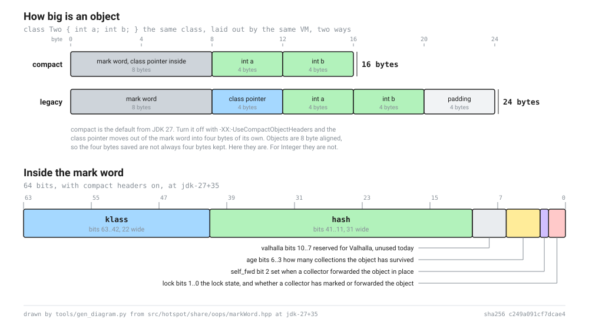

# The lesson format

A lesson is one directory. Everything a reader sees, and everything a checker checks, comes out of it.

```
lessons/O01/
  lesson.py     the source, and the only file a human edits
  grade.py      the boss fight grader
  claims.json   the claim ledger for this lesson
  baked/        recorded outputs for cells that cannot produce stable output
notebooks/O01/
  lesson.ipynb  generated by tools/build.py, committed, never hand edited
```

`lesson.py` is Python in jupytext percent format. It stays valid Python so that ruff, black and a language server all work on it, and so that a reader who opens it outside Jupyter sees something readable rather than a wall of JSON.

## Front matter

The file starts with a fenced comment block.

```python
# ---
# id: O01
# title: How big is an object
# question: How big is a bare Object, and why is the answer different from the one you learned?
# part: 0
# pin: jdk-27+35
# blueprints: [BP-HEADER]
# requires: []
# flags: [UseCompactObjectHeaders]
# terms: [object header, mark word]
# reviews:
#   beginner: null
#   expert: null
# ---
```

`id`, `title`, `question`, `part` and `pin` are required. The `id` has to match the directory name, and the `pin` has to match `jdk_tag` in `docs/pin.json`, so a lesson written against a tag nobody pinned fails the build rather than shipping.

The parser accepts a small subset of YAML on purpose: a flat mapping of scalars, `key: [a, b]` lists, and one level of nesting written with two spaces. Anything else is refused with the line number. A lesson header that needs more than that has grown a second job.

## Cells

A cell starts at a line beginning with `# %%`. What follows on that line is the cell type and the directives.

```python
# %% [markdown] id=hook
# Prose goes here, as ordinary comments. The `# ` prefix is stripped when the
# notebook is built.

# %% id=header_size_compact tags=[bake] env=E0
jvx.run("-XX:+UseCompactObjectHeaders", () -> ClassLayout.parseClass(Object.class));
```

| Directive | What it does |
|---|---|
| `id=` | A stable name for the cell. Lower case, digits and underscores |
| `tags=[...]` | Any of `predict`, `bake`, `slow`, `solution`, `skip-ci` |
| `env=` | `E0`, `E1` or `E2`. Defaults to `E0` |
| `replay=` | The recorded transcript a tier 0 reader steps through instead of running an `E1` cell |
| `generated=` | `badge` or `bootstrap`. The build writes the cell's body, the lesson only says where it goes |

Anything else on the marker line is an error rather than something ignored, because a silently ignored directive is a lesson that does not do what its author thinks it does.

Give an `id=` to any cell a claim depends on, and then never change it. The claim ledger cites cells by id, so renaming one breaks the ledger entry without breaking the build. Ids are additive. Name them for what they show, so `header_size_compact` rather than `cell_7`.

## Generated cells

Two cells in every lesson are written by the build rather than by the author. The lesson source declares where they go and leaves them empty:

```python
# %% [markdown] id=badge generated=badge

# %% id=bootstrap generated=bootstrap env=E0
```

Writing anything in the body of a generated cell is an error, not a warning. The build would overwrite it, and losing somebody's work silently is worse than refusing it loudly.

`badge` is the Open in Colab badge, the lesson's question and a line saying which pin the numbers on the page came from.

`bootstrap` is the cell every reader runs first. It inlines every file in `jvx/` in filename order, then calls `jvx.banner()`. The mark word bit positions inside it are filled in from `docs/generated/markword.json`, which `tools/gen_markword.py` reads out of HotSpot's own `markWord.hpp` at the pinned tag, so no bit position is typed by hand anywhere between the header file and the reader's screen.

Inlining rather than fetching a jar is the right shape for now for one reason: a reader who clicks a badge should not be waiting on Maven Central, and a project with no release yet should not pretend it has one. When `jvx` is published this cell becomes a `%maven` line and nothing else changes, because every lesson already goes through `jvx.` rather than through the classes underneath.

A generated cell's id is a hash of what ships, not of the empty placeholder in the source. So editing anything in `jvx/` moves the bootstrap cell's id in every lesson at once, which is the honest answer: the cell really did change in every one of them.

The bootstrap is not baked. The banner prints the reader's own VM version, platform and flag values, and baking somebody else's would put a laptop in California at the top of every lesson, labelled as if it were the reader's machine. That is exactly the confusion the banner exists to prevent.

## Prediction gates

A gate is three calls, and no lesson ever names the class underneath them:

```java
jvx.gate("gate_1", "How many bytes is a bare Object on JDK 27?",
    "a) 8", "b) 12", "c) 16", "d) 24");
jvx.answer("gate_1", "c");
jvx.reveal("gate_1", "a");
```

`gate` asks and shows nothing. `answer` records and marks nothing. `reveal` marks it, and it goes in a cell after the measurement, not before. The explanation of why the wrong answers are wrong belongs in the markdown cell under the reveal rather than in a Java string.

A reader who runs the reveal without answering is told the answer anyway, along with a note that they got less out of it than they could have. Refusing would be truer to the idea and would also strand anybody who hit Run All in a cell that will not talk to them.

This is the text version. It works in a notebook with no widgets, in a terminal and in a printed transcript. The `PredictGate` widget replaces `Gate` when probe #4 has an answer, and no lesson changes when it does.

## Diagrams

`tools/gen_diagram.py` draws the object header from `docs/generated/markword.json` and writes two files:

```
docs/generated/markword.svg          what a page or a notebook shows
docs/generated/markword.excalidraw   the same drawing, editable at excalidraw.com
```



Nothing in either one is typed by hand. There is a mark word diagram in a lot of blog posts and most of them are wrong now, because they were drawn once by somebody who read `markWord.hpp` on the day and the file moved twice since. A picture is the most convincing wrong thing a page can have: nobody re-derives a diagram, they believe it. Here a field that moves fails CI, the JSON is regenerated and the drawing moves with it.

The excalidraw file exists so the drawing can be opened and adjusted. Move things around in it, but fix a bit position in the generator rather than in the file, because the next regeneration overwrites it.

Colour never carries meaning on its own. Every box is labelled in words as well, so the drawing reads the same in greyscale and to a reader who cannot separate two of the hues.

## Tags

`predict` is a prediction gate. It is a code cell because it renders a widget.

`bake` means the cell cannot produce stable output, so its output is read from `baked/<id>.json` instead of from a live run. That file is a JSON list of nbformat outputs, produced by CI on the pinned JDK. A `bake` cell needs an `id=` because the id is the filename.

When a `bake` cell has no recording yet, the notebook gets a visible placeholder saying so. That is deliberate. This project's first rule is that nothing is asserted the reader cannot watch happen, and inventing an output to fill a gap would break that rule in the worst possible place.

`slow` marks a cell that takes long enough to warn about. `solution` is hidden by default. `skip-ci` is for cells that cannot run in CI, and it needs a reason in a comment on the line above.

## The build

```
python tools/build.py new O02        scaffold a lesson
python tools/build.py notebooks      compile every lesson
python tools/build.py check          rebuild in memory and fail on any difference
python tools/build.py list           print the lesson index
python tools/build.py run O01        execute a lesson, if a Jupyter runtime is here
```

The notebook is output and never input. Nobody edits `notebooks/`. `build.py check` rebuilds every lesson in memory and compares byte for byte against what is committed, and it names the cell when they differ.

Three decisions make the output byte stable. Cell ids are a SHA-256 of the cell's type, its directives and its source, truncated to sixteen hex characters, so an unchanged cell keeps its id forever and a diff shows only the cells that actually changed. Execution counts are never written, so a notebook cannot carry hidden state about the order somebody happened to run things in. Outputs come from `baked/` or from nowhere.

If two cells in one lesson are byte for byte identical, the second one gets a salted hash, because nbformat requires cell ids to be unique. That path is deterministic too.

## What check enforces

Beyond the byte comparison, `build.py check` enforces the caps and the structural rules from the authoring guide: cell ids unique within a lesson, a `bake` cell has an id, a `predict` gate is a code cell, at most 24 tier 0 code cells, at most 5 prediction gates and at least one, at most 3 new flags and 4 new terms, the hook under 150 words, the tour under 1500, the whole lesson under 2500, every `requires` entry naming a real lesson, no cycle in the `requires` graph, the front matter pin agreeing with `docs/pin.json`, and a `grade.py` present.

A lesson with `status: draft` in its front matter is exempt from the prediction gate rule and the grader rule, which is what lets a work in progress live on a branch without turning CI red for a week.

It also checks the generated cells: exactly one `generated=badge` and one `generated=bootstrap` per lesson, an empty body on both, and the bootstrap being the first code cell. That last one matters because the bootstrap is what defines `jvx`, so a code cell above it runs against a kernel that does not have it yet, and that failure reads as "the lesson is broken" to a reader who has done nothing wrong.

`tools/prosecheck.py` reads the markdown cells out of `lesson.py` and the comments out of `jvx/*.jsh`, and applies the prose rules to them, reported against their real line numbers in the file they came from. The jvx comments are checked because they are inlined verbatim into the bootstrap cell, so they are the first thing a reader sees. The wrap rule is the one exception there: hard wrapping a code comment is what every reader expects, and the rule exists to keep prose diffs readable rather than to forbid wrapping as such.

## Running the tests

```
python tools/test_build.py
python tools/test_gen_markword.py
python tools/test_gen_diagram.py
```

Seventy five tests, standard library only. The two that matter most are `test_three_builds_are_byte_identical` and `test_check_catches_a_one_character_edit`, because those two are the promise the pipeline rests on.

The harness copies the real `jvx/` and the real `docs/generated/markword.json` into its temporary directory rather than using a fixture, so the generated cell tests build against the sources that actually ship.
