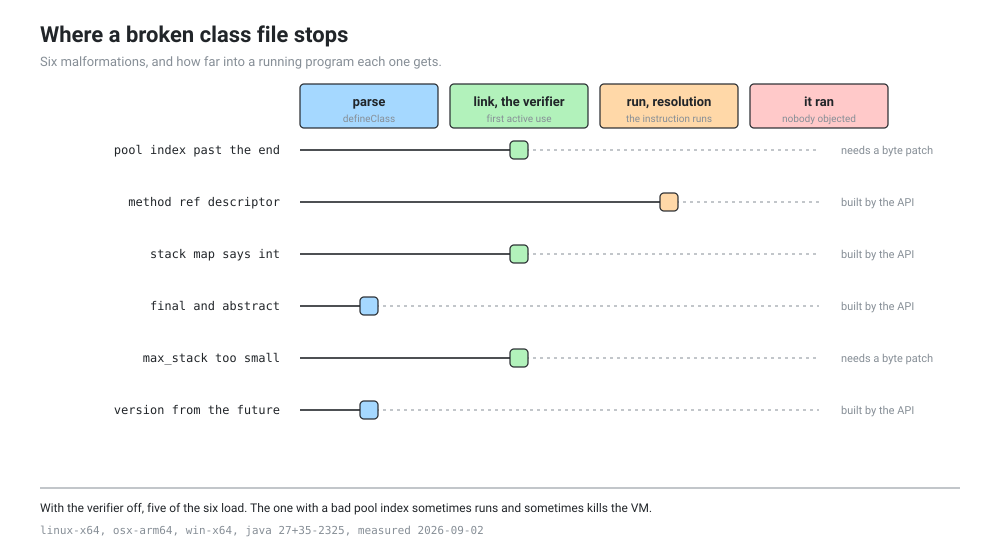

# Six class files that are wrong on purpose

B11 is a boss fight about the verifier, and four other lessons want to show a reader a class file the JVM refuses. All of that rests on being able to make one on demand, for a stated reason, without hand assembling bytes. `java.lang.classfile` is a well designed API, and a well designed API stops you writing nonsense, so the question issue #7 asks is where it stops you and what is left after it does.

Six malformations, three platforms, two questions each. Can the API express it, and where does the JVM notice. The full table is [six class files that are wrong on purpose](../generated/malformed-class-files.md), generated from the results and unable to drift from them. This page is the reading.



## The headline

**Four of the six build straight through the API. The other two need a byte patch of about five lines.** Nothing is out of reach, so the fallback in the issue never has to be taken and B11 is not blocked.

The two the API refuses are refused for the same reason, which is the interesting half of the result. `java.lang.classfile` does not let you name a constant pool index, because the builder issues pool entries and hands you back a handle rather than a number, so there is no place to type 9999. It does not let you set `max_stack` either, because the builder computes it from the code you wrote. Both refusals are the API being right. An index you did not write cannot be wrong, and a stack depth that is derived cannot disagree with the body under it.

That is worth saying to a reader directly. The API is not missing a feature here. It has been designed so that a whole class of malformed file is unreachable, and the way to get one anyway is to build a valid file and then edit the bytes, which is exactly what the lesson wants to show.

## Where each one stops, and why the order matters

The four stages in the picture are the four times the JVM looks at a class file, and each malformation is caught at the first one that would notice.

**Parse, which is `defineClass`.** Structure, flags, versions, and whether indices point inside the pool at all. The class that is both `final` and `abstract` dies here with `ClassFormatError`, before any bytecode is looked at. So does the file with a major version above what this JDK reads, with `UnsupportedClassVersionError`. Neither of these needs the verifier and neither of them cares what the methods contain.

**Link, which is the verifier, at first active use.** Three of the six die here, all with `VerifyError`: the bad pool index, the lying stack map frame, and the `max_stack` that is too small. The messages are worth reading in full in the results files, because the verifier prints the frame it computed next to the frame the file claimed, which is the single most teachable output in this whole probe.

**Run, which is resolution, when the instruction actually executes.** The method reference whose descriptor matches nothing gets all the way here. The file is structurally fine and the verifier is happy, because the verifier checks that the descriptor is consistent with the stack, not that anything on the other end answers to it. It is only when `invokestatic` runs that anybody looks for `int java.lang.String.length(int)` and fails to find it, with `NoSuchMethodError`.

That last one is the lesson. Three different errors for three different kinds of wrong, thrown at three different moments, and a reader who has watched all three understands why the JVM has three stages instead of one.

## What happens with the verifier off

Ten runs of each, with `-XX:-BytecodeVerificationLocal` and `-XX:-BytecodeVerificationRemote`. Five of the six load and four of them run their broken method to completion.

The class that is both `final` and `abstract` is the surprise. It is rejected at parse with the verifier on, and it loads and runs with the verifier off. That means the format check which rejects it is conditional on verification being on, so turning the verifier off does more than skip the verifier. It relaxes the parser too. Anybody writing a lesson that says "the verifier checks bytecode, the parser checks structure" needs to know that the second half is not unconditional.

The bad pool index is undefined behaviour in the plainest sense of the phrase, and it is the reason this probe runs each case ten times instead of once.

| | outcome over ten runs |
|---|---|
| linux-x64 | died all 10 times, `SIGSEGV` |
| win-x64 | died 3 times with `EXCEPTION_ACCESS_VIOLATION`, ran the other 7 |
| osx-arm64 | died once with `SIGBUS`, ran the other 9 |

Same file, same JDK build, three different answers, and two of the three are not even stable within one machine. The interpreter takes an index nobody checked, reads whatever is at that offset, and whether that address happens to be mapped is a property of the run. A single sample would have reported one of these and it would have been true, which is worse than being wrong, because nobody would have gone back to check it.

This is the most honest demonstration of what the verifier is for that this repository has. It is not a style checker. It is the thing standing between a two byte edit and a process that dies in a different way each time you start it.

## The flags a reader will type, two of which no longer exist

| flag | what happens |
|---|---|
| `-Xverify:none` | `Unrecognized verification option` |
| `-noverify` | `Unrecognized option` |
| `-XX:-BytecodeVerificationLocal` | works, with `-XX:+UnlockDiagnosticVMOptions` |
| `-XX:-BytecodeVerificationRemote` | works, with `-XX:+UnlockDiagnosticVMOptions` |

The two spellings in every blog post from the last fifteen years are gone. They were deprecated in 13 and they are now removed, so a reader following an old tutorial gets a VM that refuses to start and no hint about what to type instead. The two that work are diagnostic options and need the unlock in front of them, which means a lesson has to give the reader all three words or none.

The probe asks each flag on its own first and only retries with the unlock when the VM says the option is locked, so "rejected" in the table means genuinely gone rather than merely guarded.

## Can you still show the reader the file

Five of the six, `javap -v` prints in full, bad bytes and all. That matters more than it sounds. A lesson that says "here is a broken class file" has to be able to print the broken part, and a disassembler that gave up at the first bad byte would turn the exercise into a screenshot of an error message.

The exception is the file with a version from the future, which `javap` refuses outright with `Unsupported class file version: 72`. Reasonable, and worth planning around: the version case is the one malformation that has to be discussed rather than displayed, or displayed with a hex dump instead.

## What this means for the lessons

B11 gets all six, four of them in a few lines of builder code and two of them with a patch step that is worth showing rather than hiding. The class file fuzzer can generate valid files with the API and corrupt them afterwards, which is a better design than trying to make the API emit garbage anyway, because the corruption step is the part the reader learns from.

The four stage picture at the top of this page is reusable as it stands. It is generated, so when a seventh malformation is added the picture updates with it.

One thing to carry forward into B11: the verifier off runs have to be a subprocess, and on Linux they will kill it. A notebook cell that runs the bad pool index in the kernel process takes the kernel with it. The lesson needs to spawn a JVM, let it die, and show the reader the exit signal, which is a nicer demonstration than a crashed notebook anyway.

## Running it yourself

Point `JAVA_HOME` at the pinned JDK. No network, no root, a few seconds.

```
python probes/classfile-malformed/run.py --out probes/classfile-malformed/results/mymachine.json
python tools/gen_malformed_table.py
```

`probes/classfile-malformed/Malformed.java` is the half that has to run inside a JVM, because building a class file and loading it are both in process activities. It is a single source file run by the source launcher, so there is nothing to compile. Adding a seventh case means adding one method there and one name to the two lists in `run.py`, and the tests will tell you if you forget the second part.

Expect a crash report on the console. That is the probe working.
