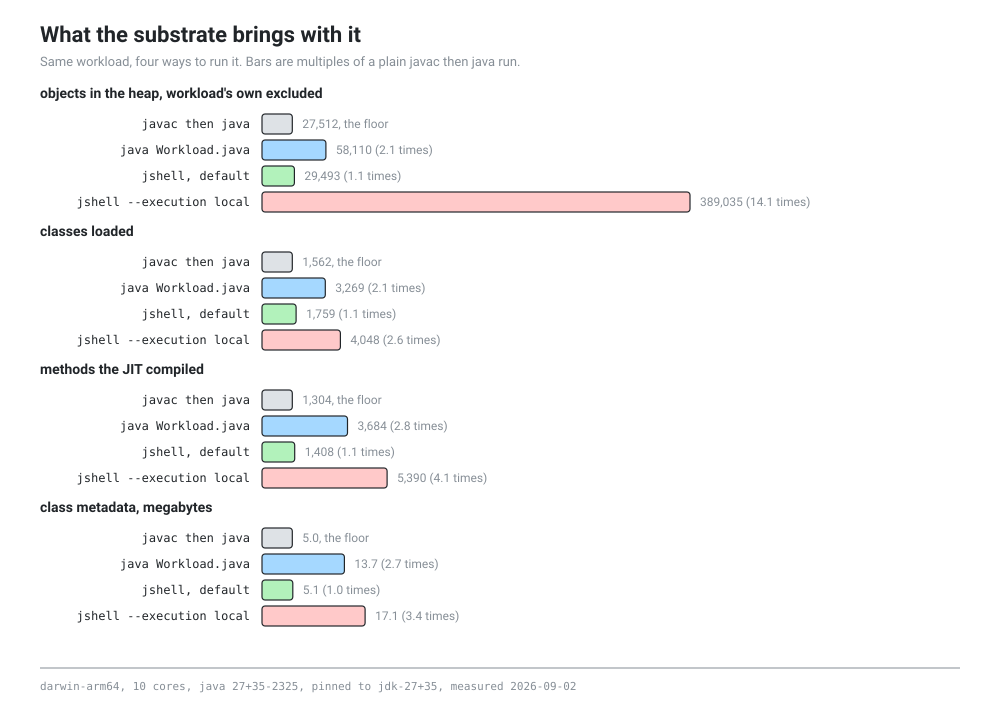

# How much does JShell distort what a lesson can observe

This answers issue #2, which is one of the four things M0 is allowed to fail on. The short version is that it does not fail, but the line is in a more awkward place than expected, and the awkward part is the configuration a notebook actually uses.

Everything here was measured. The harness is `probes/jshell-noise/run.py`, the raw numbers are in `probes/jshell-noise/results/`, and both can be rerun on any machine with the pinned JDK on it. Nothing in this document is an estimate.

## What was measured

The same workload runs four ways. It allocates fifty thousand small objects, keeps them alive in a static field, spins a small hot method two million times so the JIT has something to do, and then asks the VM about itself from the inside. Asking from the inside matters: an external `jcmd` has to find a process and attach to it, which loads classes of its own and happens at whatever moment the attach completes, so the four arms would not be observed at the same point in their lives.

The four arms:

| arm | what it is | why it is here |
|---|---|---|
| `compiled` | `javac`, then `java` | the floor, and the number everything else is divided by |
| `launcher` | `java Workload.java` | the JEP 330 source launcher, which is what `jvx.run` does |
| `kernel` | `jshell` with its default provider | JShell as the command line ships it |
| `kernel-local` | `jshell --execution local` | JShell with the code in the same JVM as the compiler |

The last two are both JShell and they are not close to each other, which is the finding. The default provider starts a second JVM and runs the reader's code over there. `--execution local` runs it in the same JVM that JShell's own compiler lives in. A notebook kernel is a long lived process that compiles snippets and runs them without spawning anything, so `kernel-local` is the arm that models it.

Six observation types, the ones the research document called for:

1. class histogram, from `GC.class_histogram`
2. class loading, from `-Xlog:class+load=info` counted line by line
3. compilation, from `-XX:+PrintCompilation` and `-XX:+LogCompilation` together
4. JFR event counts by type, from a `settings=profile` recording summarised with `jfr summary`
5. heap dump object counts, from `tools/hprof_count.py`
6. `GC.class_stats`

## The picture



The bars are multiples of the plain compiled run. The workload's own fifty thousand objects are excluded from the first group, because they are identical on every arm and leaving them in turns a factor of fourteen into a factor of five and a half.

## The numbers

osx-arm64, 10 cores, and linux-x64, 8 cores, both on java 27+35-2325 pinned to jdk-27+35. Two rows per arm, the laptop first.

| arm | classes loaded | histogram classes | heap objects | JIT compiles | compiles you can see | JFR events | metaspace |
|---|---|---|---|---|---|---|---|
| `compiled` | 1,562 | 665 | 77,512 | 1,304 | 800 | 3,770 | 5.0 MB |
| | 1,590 | 686 | 77,826 | 1,376 | 803 | 3,060 | 5.0 MB |
| `launcher` | 3,269 | 1,123 | 108,110 | 3,684 | 2,262 | 4,359 | 13.7 MB |
| | 3,282 | 1,132 | 108,127 | 3,910 | 2,235 | 3,853 | 13.6 MB |
| `kernel` | 1,759 | 773 | 79,493 | 1,408 | **0** | 3,872 | 5.1 MB |
| | 1,786 | 789 | 79,775 | 1,520 | **0** | 3,930 | 5.1 MB |
| `kernel-local` | 4,048 | 1,876 | 439,035 | 5,390 | 3,411 | 4,890 | 17.1 MB |
| | 4,261 | 1,915 | 500,385 | 5,710 | 3,325 | 5,148 | 18.4 MB |

The two platforms agree on every ordering, and on the class, compilation and metaspace columns they are within a few percent of each other. Two columns are not that tight. The `kernel-local` heap count is 14 percent higher on Linux, because that arm holds a live javac in the same heap and its object count depends on when a collection last ran. The JFR counts differ by up to 23 percent between machines, because most JFR events are periodic samples and the two machines do not take the same time to finish. Neither of those should be read as precise. The ordering is the result, not the digits.

## Six findings

### 1 The default JShell is quiet, and much quieter than the escape hatch

This was the surprise. `kernel` loads 13 percent more classes than a plain compiled run and holds 7 percent more background objects. `launcher`, which is what `jvx.run` does, loads 109 percent more classes and holds 111 percent more background objects.

The reason is that JShell's default provider puts the reader's code in a second JVM that contains nothing but the code and a small agent. The compiler stays in the first JVM. Meanwhile the source launcher compiles in memory, so javac is in the process for the whole run: 1,235 of the launcher's class loads are javac's own.

So the subprocess escape hatch is not free, and for anything that counts classes it is noisier than the kernel it exists to escape from. That is worth knowing before reaching for it out of habit.

### 2 Running in process, which is what a notebook does, is a different world

`kernel-local` holds 389,035 objects that the workload did not allocate, against 27,512 for the compiled run. Fourteen times. It loads 2.6 times as many classes and its metaspace is 3.4 times larger.

Nothing subtle is going on. Under `--execution local` the JShell compiler, the whole of javac, and the reader's code share one heap. Every heap count, every histogram, every object population question is then dominated by the tool rather than by the subject.

This is the arm that matters for the E0 tier, because a notebook kernel is a long lived process that compiles and runs in itself. That makes it the arm that draws the line below.

### 3 Your class is not called what you called it

In every JShell arm, `Workload$Widget` appears in the class histogram as `REPL.$JShell$9$Workload$Widget` and in the heap dump, which uses the JVM internal form, as `REPL/$JShell$9$Workload$Widget`.

The digit is a snippet counter, so it changes if the reader runs cells in a different order. Any lesson that asks a reader to find their class by name in a histogram, or that compares a name against a string, breaks in a way that looks like the reader's mistake.

### 4 Compilation output from the default kernel is invisible

`kernel` shows 1,408 compilations in the log file and 0 on stdout, on both platforms.

The flag does reach the agent JVM. `-XX:+LogCompilation` writes a 2.4 MB file with 726 compile tasks in it, so the JIT is working and the VM is doing what it was asked. It is the stdout of the agent that never comes back: JShell forwards `System.out` from the agent over its socket, and `PrintCompilation` does not write to `System.out`, it writes to the VM's own stream.

So on the default provider a reader cannot watch compilation happen at all. Under `--execution local` they can, and they see 3,411 lines of which a large share are javac compiling their snippets rather than the VM compiling their code.

### 5 GC.class_stats no longer exists

The research document lists it as one of the six. On jdk-27+35 the dcmd is gone. `jcmd <pid> GC.class_stats` answers `java.lang.IllegalArgumentException: Unknown diagnostic command`, and it is not in `jcmd help`.

`VM.classloader_stats` covers what this probe wanted from it, which is how much class metadata the substrate is carrying, and that is the metaspace column above. Any lesson or blueprint that was going to reach for `GC.class_stats` needs rewriting rather than porting.

Two smaller things found on the way. `GC.heap_dump` is reachable from `jcmd` but is not published as an operation on the DiagnosticCommand MBean, so an in process dump has to go through `HotSpotDiagnosticMXBean.dumpHeap` instead. And VM options passed to `jshell` with `-R` are accepted and then silently ignored under `--execution local`, because `-R` means the remote agent and there is no remote agent. They have to go to JShell's own JVM with `-J`. Neither of those warns.

### 6 JFR barely notices which arm it is on

The worst arm records 1.3 times the floor's events on the laptop and 1.7 times on the Linux machine, across arms whose heap counts differ by a factor of fourteen. All eight runs produce exactly 199 event types.

JFR events are mostly periodic samples and VM lifecycle events, so they count time and not objects, and the noisier arms are noisier mainly because they take longer to finish. That makes JFR the most portable of the six observations, and the one least worth running in a subprocess.

## Where the line goes

The threshold in issue #2 asked for a published table with a line drawn on it. Here it is. "Kernel" below means the in process kernel, `kernel-local`, because that is what a notebook is.

| observation | in the kernel | verdict |
|---|---|---|
| a specific object's header, size or field offsets | unaffected, the object is the reader's own | **kernel** |
| field layout and instance size of a named class | unaffected | **kernel** |
| bytecode, class file structure, constant pool | unaffected, it is a file on disk | **kernel** |
| identity hash of a fresh object | distorted by the variable machinery | **kernel, with care**, see below |
| JFR event counts and types | at most 1.7 times the floor | **kernel** |
| class loading counts | 2.6 times the floor | **subprocess** |
| class histogram, any total | 14 times the floor on objects | **subprocess** |
| heap dump object counts | 14 times the floor | **subprocess** |
| compilation, counts or output | 4.1 times, and 0 visible on the default provider | **subprocess** |
| any observation that names a class | renamed into the REPL namespace | **subprocess** |

The identity hash line is the one already reported on issue #2 and shipped in `jvx` as of #29. JShell writes an identity hash into the header of any object assigned to a top level variable, so a lesson that wants to show a header before the hash exists has to keep the object out of a variable. `jvx.freshMark()` allocates and reads inside one method, so the reference never escapes and nothing can touch it. That does not need a subprocess.

The pattern underneath the table is simple enough to state in one sentence. **Anything about one object you are holding is safe in the kernel. Anything that counts, totals or names is not.**

## What this means for the curriculum

The kill criterion for this probe was that JShell's distortion could not be routed around for the observations the curriculum depends on. It did not fire. Every distorted observation in the table has a working route, and the route is the `jvx.run` subprocess that the architecture already assumed.

Two things do change.

The subprocess is needed more often than the specification implied, and specifically for the whole object population and class loading family. Those were expected to be kernel observations. They are not.

And the subprocess is not clean either. `jvx.run` uses the source launcher, which drags javac into the process and doubles the class count. For a lesson that counts loaded classes that is not a floor, it is a different distortion. `jvx.run` should grow a compiled mode that runs `javac` first and then `java` on the class file, which is the `compiled` arm above and is the only genuinely quiet option of the four. That is a change to `jvx`, not to the architecture, and it is small.

## What is still open

Which execution provider a Colab notebook kernel actually uses is not measured here, and it decides which of the two kernel arms applies. Both are measured, so whichever it turns out to be there is a number for it, but the answer belongs to issue #1 and the cold Colab bootstrap.

`jvx.run` does not have the compiled mode described above yet.

## Reproducing this

The pinned JDK has to be on `JAVA_HOME` or on `PATH`. Nothing else is needed and nothing touches the network.

```
python probes/jshell-noise/run.py --out probes/jshell-noise/results/mymachine.json
python probes/jshell-noise/run.py --arm kernel-local --keep /tmp/noise
python tools/hprof_count.py /tmp/noise/kernel-local/kernel-local-main/heap.hprof --top 20
```

On a slow machine the default JShell handshake can time out, because the agent JVM has a flight recording to start before it can call back and that took eight seconds on one of the test machines. The harness raises that deadline to sixty seconds on every arm so the runs stay comparable.
