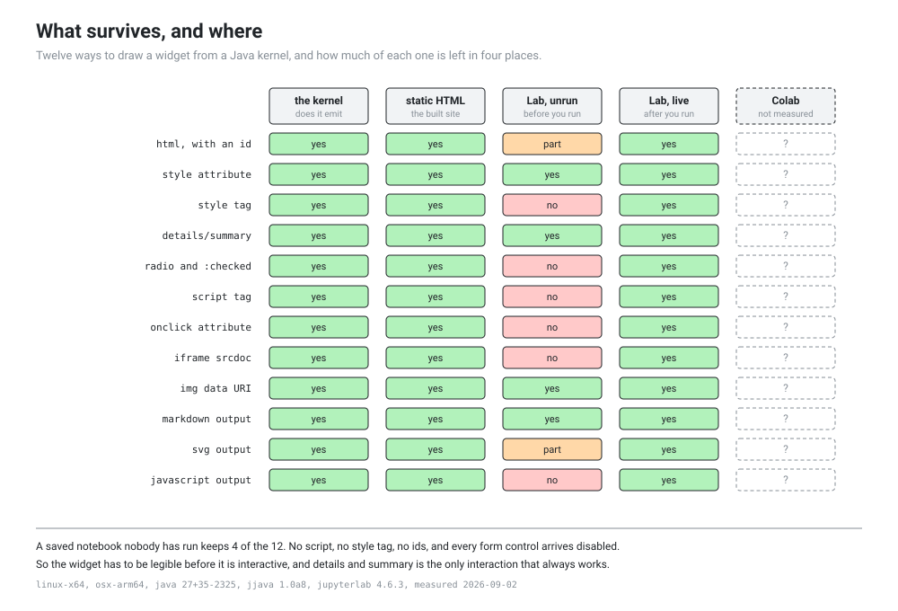

# What a Java kernel can put on the screen

Issue #4 asks whether the three widgets survive Colab's output sandbox. Before that can be answered there is a question underneath it that the specification got wrong, and finding it is most of what this probe is worth.

The plan said anywidget, which is a Python library. The kernel is JJava, which is JShell. A Python widget library cannot run in a Java kernel, so there is no widget protocol here at all: no comm channel, no `enable_custom_widget_manager`, no model synchronised between the browser and the process. What a lesson can do is hand the front end a MIME payload and hope it survives. So the real question is which payloads survive, and where.

Twelve techniques, four places each. The full table is [what a Java kernel can put on the screen](../generated/widget-delivery.md), generated from the results. This page is the reading.



## The four places, and why the third one is the answer

**The kernel** is whether JJava emits the payload at all. It emits all twelve, including `image/svg+xml` and `application/javascript`, so nothing is lost on the way out of the process. That column is green all the way down and it is the least interesting one.

**Static HTML** is what `jupyter nbconvert --to html` builds, which is what the site will serve. Nothing is sanitized. Scripts run, `onclick` fires, style tags apply. All twelve work.

**Lab, unrun** is a saved notebook somebody opened and has not executed. This is what a reader gets when they click a link, and **four of the twelve survive it**. It is the column that decides how the widgets get built.

**Lab, live** is the same output one second after the running kernel produced it. All twelve work, exactly like the static HTML.

The difference between the third column and the fourth is not the front end and it is not the payload. It is trust. Jupyter treats output that came from your own kernel in this session as yours, and output that arrived in a file as somebody else's, and it sanitizes the second kind. Same notebook, same browser, same second: read it and you get one thing, run it and you get another.

## What the sanitizer does, exactly

Worth naming precisely, because each one is a design constraint and none of them announce themselves. The markup is still in the file, and it still looks right when you read it.

**`<style>` tags are removed and the class attribute is kept.** So an element still says `class="thing"` and there is no rule anywhere that matches it. Every CSS trick a widget would use dies here, including the whole `:checked` family that would otherwise give a scrubber without JavaScript.

**`id` becomes `data-jupyter-id`.** Not dropped, renamed. Anything that finds an element by id, and every `label for=`, quietly stops matching.

**Form controls arrive disabled.** `<input type="radio">` comes through with `disabled` added, so the reader cannot click it even if the styling had survived.

**`<script>` is removed, `onclick` is stripped, `<iframe>` is removed entirely.**

**`application/javascript` output is not executed** and `image/svg+xml` output is shown as escaped source text in a `<pre>`, which is uglier than showing nothing.

The four that come through whole are a `style` attribute on the element, `<details>` with `<summary>`, an `` whose `src` is an SVG data URI, and `text/markdown`.

## The rules that follow

This is a smaller budget than the specification assumed, and it is enough.

**Inline styles only, no style tags.** Every colour, border and font goes in a `style` attribute on the element that needs it. Verbose to generate and completely reliable.

**`<details>` is the only interaction that always works.** It is native HTML, it needs no CSS and no JavaScript, and it survives sanitizing. A prediction gate is a question with a hidden answer, which is exactly one `<details>`, so `PredictGate` can be built out of the one thing that never breaks.

**Pictures go in an `` with a data URI, never as `image/svg+xml` output.** The same SVG bytes, base64 encoded into an `src`, render everywhere including the unrun notebook. This is the single most useful line in this report, because it means `HeapLens` and `WarmupTape` can draw anything they can draw as an SVG.

**No ids, ever.** Style by element and by inline attribute, not by selector.

**Interactivity is an upgrade, not the product.** Something that reads correctly with no CSS and no JavaScript, and gets better when the reader runs it. Which means the widget has to say the same thing twice, once in markup and once in behaviour, and the markup version is the one that ships in the static site.

## The fallback in the issue, chosen deliberately

Issue #4 said that if interactivity in Colab proves fragile, the answer is fewer and sturdier widgets. On this evidence it is fragile in a way nobody would have predicted, since the fragility is not Colab's iframe but Jupyter's trust model, and it applies to every front end.

So: fewer and sturdier. `PredictGate` becomes a `<details>` and works everywhere on day one. `HeapLens` and `WarmupTape` become generated SVG in an ``, with a `<details>` per row for the parts that would have been a hover or a click. A reader who runs the notebook gets the same picture the site shows. Nothing degrades, because there is no rich version to degrade from.

## What is not answered

**Colab.** It is not in the grid and it is the environment this project exists for. Colab is not JupyterLab, it has its own sanitizer, and it renders output in a per output iframe, so its column could differ from all four measured here in either direction. The probe is a script and Colab is a browser, so this lands with issue #1 and not before.

Two things make that wait easier to bear. Everything in the rules above is a subset of what already works in three measured places, so the risk is that Colab allows more rather than less. And a widget built to the unrun rules has no JavaScript to block and no style tag to strip, which is the smallest possible target for a sanitizer nobody has read.

## Two things to fix in `jvx`

**Every `display` call prints a UUID.** JJava's `display` returns the id it assigned, JShell prints the value of the last expression, and the reader gets a line of hex under every widget. Twelve cells, twelve UUIDs. A helper that swallows the return value fixes it and it has to exist before any widget ships.

**JJava mutates final fields and JDK 27 says so.** Starting the kernel prints three warnings about reflective final field mutation, ending with the notice that a future release will block it. It works today. It is worth watching, because the day it stops working the whole E0 tier stops with it.

## Running it yourself

This one needs more than a JDK. A virtual environment with JupyterLab, the JJava kernel and a headless browser, because the questions it asks cannot be answered by reading the HTML.

```
python -m venv .venv
.venv/bin/pip install jupyterlab nbclient nbconvert jjava playwright
.venv/bin/playwright install chromium
JAVA_HOME=... .venv/bin/python probes/widgets/run.py --out probes/widgets/results/mymachine.json
python tools/gen_widget_matrix.py
```

It takes about a minute. It starts a JupyterLab on the loopback address with a random token, drives a chromium through it, and shuts both down. It is not in CI and it is not going to be, because a probe that needs a browser and a JDK is not a thing to run on every push.

Measured on two platforms, which agree on all forty eight answers. That is expected rather than reassuring: the sanitizer is JavaScript running in a browser, so the thing that decides these answers is the JupyterLab version and not the machine. The version is in the table for that reason.
